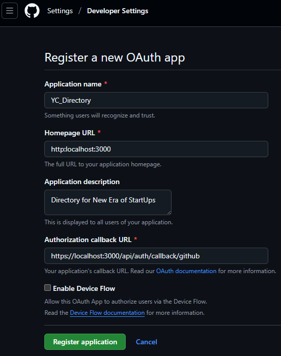

# Notes from start to end

- Setup
- Removed Default `README.md` Content
- Enforcing Dependency Versions
- Starting with Authentication using Auth.js.
- Improve our File and Folder Structure before implementing Authentication.

## Improve our File and Folder Structure before implementing Authentication

- let's create a new `Route Group` - `(root)` - which will be our `Home Page`. Move our `app/page.tsx` into `(root)/page.tsx` & also create a `layout.tsx` file -> means what we apply to this layout will only be applied to the pages within this route group.
- create `components` folder in `app` directory and create a `Navbar.tsx` component which we will add in `layout.tsx`. if you got to localhost -> you will be able to see `Navbar` at the top and `HOME` below it.
- Right within the Navbar we will implement our NextAuth.

## Starting with Authentication using Auth.js

- [Official Doc](https://authjs.dev/) - which is also known as NextAuth.
- [Installation](https://authjs.dev/getting-started/installation):
  - #1 -> Installing Auth.js
  - #2 -> Setup Environment : The only environment variable that is mandatory is the AUTH_SECRET. This is a random value used by the library to encrypt tokens and email verification hashes. -> Creates a new `.env.local` file with `AUTH_SECRET`.
  - #DOIT -> Implement our configuration: create the Auth.js config file and object. This is where you can control the behavior of the library and specify custom authentication logic, adapters, etc. We recommend all frameworks to create an auth.ts file in the project.
    - create a new `auth.ts` file at the root of your app
    - Add a Route Handler under `/app/api/auth/[...nextauth]/route.ts`.
      - create a the following folders in order under `app` directory/Folder -> `api` FOLDER-> `auth` FOLDER -> `[..nextauth]` FOLDER -> `route.ts` FILE
    - For now `Skipping` : Add optional Middleware to keep the session alive.
    - Setup Authentication Methods: we’ll setup the first authentication methods and fill out that `providers` array - At this point, `you need to decide how you’re gonna authenticate users in your application`. Auth.js supports four main authentication paradigm.
      - We will go with `OAuth`: Recommended because `OAuth services spend significant amounts of money, time, and engineering effort to build abuse detection (bot-protection, rate-limiting), password management (password reset, credential stuffing, rotation), data security (encryption/salting, strength validation), and much more.`
      - We will go with `Github` which one of the popular provider for Authentication.
      - When registering an OAuth application on GitHub, they will all ask you to enter your application’s callback URL.
      - In our case, we need to set it up from scratch - Let's go to `connections` -> `providers` -> [Github](https://authjs.dev/getting-started/providers/github) - here we get all the information on how we can create a new GitHub OAuth App - which we need for the setup. For more instructions head over to this [DOC](https://docs.github.com/en/apps/oauth-apps/building-oauth-apps/creating-an-oauth-app) - steps needed to create a GITHUB OAuth APP.`http://localhost:3000`
        
        - Copy the generated `ClientID` & add it to `.env.local` - add it as `AUTH_GITHUB_ID & AUTH_GITHUB_SECRET`
        - You can also add your app-logo by referring to the complete figma design for this project
        - We will revisit this page again at the end of the course with our new deployed URL.
        - Copy the `configuration` code and add it to our `auth.ts` file - updating our existing file and add a `GITHUB` Provider.
- So How do we make it work? : Go to `app/Page.tsx` & remove all the default code. just add a fragment & HOME text.

```bash
#1
pnpm add next-auth@beta
#2
$ npx auth secret
Need to install the following packages:
auth@1.2.3
Ok to proceed? (y) y

📝 Created C:\Users\abhis\Desktop\NextJs Projects\yc_directory_nextjs\.env.local with `AUTH_SECRET`.
#3

```

## Enforcing Dependency Versions

- If we go to `package.json` - we see we're using latest version of react,react-dom & nextjs & we also need to make sure all the other packages & dependencies we use such as `NextAuth` also use those latest versions & not go back to using react18. So we add Two additional properties in `package.json`.

```json
"packageManager": "pnpm@10.10.0",
  "pnpm": {
    "overrides": {
      "react": "$react",
      "react-dom": "$react-dom"
    }
  },
```

- Then start our server:

```bash
abhis@Tinku MINGW64 ~/Desktop/NextJs Projects/yc_directory_nextjs (main)
$ pnpm run dev

> yc_directory_nextjs@0.1.0 dev C:\Users\abhis\Desktop\NextJs Projects\yc_directory_nextjs
> next dev --turbopack

   ▲ Next.js 15.5.3 (Turbopack)
   - Local:        http://localhost:3000
   - Network:      http://192.168.29.186:3000

 ✓ Starting...
 ✓ Ready in 3.7s
 ○ Compiling / ...
 ✓ Compiled / in 7.5s
 GET / 200 in 8757ms
```

## Removed Default `README.md` Content

````txt
This is a [Next.js](https://nextjs.org) project bootstrapped with [`create-next-app`](https://nextjs.org/docs/app/api-reference/cli/create-next-app).

## Getting Started

First, run the development server:

```bash
npm run dev
# or
yarn dev
# or
pnpm dev
# or
bun dev
```

Open [http://localhost:3000](http://localhost:3000) with your browser to see the result.

You can start editing the page by modifying `app/page.tsx`. The page auto-updates as you edit the file.

This project uses [`next/font`](https://nextjs.org/docs/app/building-your-application/optimizing/fonts) to automatically optimize and load [Geist](https://vercel.com/font), a new font family for Vercel.

## Learn More

To learn more about Next.js, take a look at the following resources:

- [Next.js Documentation](https://nextjs.org/docs) - learn about Next.js features and API.
- [Learn Next.js](https://nextjs.org/learn) - an interactive Next.js tutorial.

You can check out [the Next.js GitHub repository](https://github.com/vercel/next.js) - your feedback and contributions are welcome!

## Deploy on Vercel

The easiest way to deploy your Next.js app is to use the [Vercel Platform](https://vercel.com/new?utm_medium=default-template&filter=next.js&utm_source=create-next-app&utm_campaign=create-next-app-readme) from the creators of Next.js.

Check out our [Next.js deployment documentation](https://nextjs.org/docs/app/building-your-application/deploying) for more details.

````

## Setup

- Installation [instructions](https://nextjs.org/docs/app/getting-started/installation)

```bash
abhis@Tinku MINGW64 ~/Desktop/NextJs Projects/yc_directory_nextjs (main)
$ pnpm create next-app@latest .
.../19952aa74b5-70a4                     |   +1 +
.../19952aa74b5-70a4                     | Progress: resolved 1, reused 0, downloaded 1, added 1, done
√ Would you like to use TypeScript? ... No / Yes
√ Which linter would you like to use? » ESLint
√ Would you like to use Tailwind CSS? ... No / Yes
√ Would you like your code inside a `src/` directory? ... No / Yes
√ Would you like to use App Router? (recommended) ... No / Yes
√ Would you like to use Turbopack? (recommended) ... No / Yes
√ Would you like to customize the import alias (`@/*` by default)? ... No / Yes
Creating a new Next.js app in C:\Users\abhis\Desktop\NextJs Projects\yc_directory_nextjs.

Using pnpm.

Initializing project with template: app-tw


Installing dependencies:
- react
- react-dom
- next

Installing devDependencies:
- typescript
- @types/node
- @types/react
- @types/react-dom
- @tailwindcss/postcss
- tailwindcss
- eslint
- eslint-config-next
- @eslint/eslintrc


   ╭──────────────────────────────────────────╮
   │                                          │
   │   Update available! 10.10.0 → 10.16.1.   │
   │   Changelog: https://pnpm.io/v/10.16.1   │
   │     To update, run: pnpm self-update     │
   │                                          │
   ╰──────────────────────────────────────────╯

Packages: +325
+++++++++++++++++++++++++++++++++++++++++++++++++++++++++++++++++++++++++++++++++++++++++++++++++++++++++++++++++++++++++++++++++++++++++++
Progress: resolved 396, reused 317, downloaded 13, added 325, done

dependencies:
+ next 15.5.3
+ react 19.1.0 (19.1.1 is available)
+ react-dom 19.1.0 (19.1.1 is available)

devDependencies:
+ @eslint/eslintrc 3.3.1
+ @tailwindcss/postcss 4.1.13
+ @types/node 20.19.15 (24.5.0 is available)
+ @types/react 19.1.13
+ @types/react-dom 19.1.9
+ eslint 9.35.0
+ eslint-config-next 15.5.3
+ tailwindcss 4.1.13
+ typescript 5.9.2

╭ Warning ───────────────────────────────────────────────────────────────────────────────────╮
│                                                                                            │
│   Ignored build scripts: @tailwindcss/oxide, sharp, unrs-resolver.                         │
│   Run "pnpm approve-builds" to pick which dependencies should be allowed to run scripts.   │
│                                                                                            │
╰────────────────────────────────────────────────────────────────────────────────────────────╯

Done in 25.5s using pnpm v10.10.0
Success! Created yc_directory_nextjs at C:\Users\abhis\Desktop\NextJs Projects\yc_directory_nextjs


abhis@Tinku MINGW64 ~/Desktop/NextJs Projects/yc_directory_nextjs (main)
$ pnpm approve-builds
√ Choose which packages to build (Press <space> to select, <a> to toggle all, <i> to invert selection) · @tailwindcss/oxide, sharp, unrs-resolver

√ The next packages will now be built: @tailwindcss/oxide, sharp, unrs-resolver.
Do you approve? (y/N) · true
node_modules/.pnpm/@tailwindcss+oxide@4.1.13/node_modules/@tailwindcss/oxide: Running postinstall script, done in 373ms
node_modules/.pnpm/unrs-resolver@1.11.1/node_modules/unrs-resolver: Running postinstall script, done in 247ms
node_modules/.pnpm/sharp@0.34.3/node_modules/sharp: Running install script, done in 266ms
```
