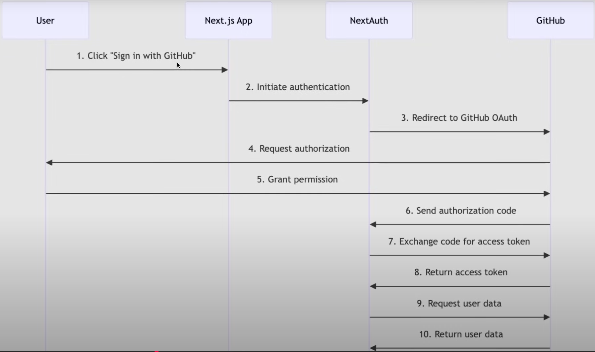

# Notes from start to end

- Setup
- Removed Default `README.md` Content
- Enforcing Dependency Versions
- Starting with Authentication using Auth.js.
- Improve our File and Folder Structure before implementing Authentication.
- Implement Auth in Navbar
- Theming & Fonts
- Hero Section
  - Key Features in Your CSS File Explained
- Search Form
- list of All startUps & Startup card - create one proper re-usable startup card.
- Sanity Setup

## Sanity Setup

- until now we have Mock(Fake) Data with us & No way to add new startup info to our app.
- We will use [Sanity](https://www.sanity.io/) - it's not just a CMS, we can leverage their API's to build OS around their content.You'll have studio that will mirror the content workspace of your application which we can hand it over to the client - so they can manage it as well. Which is built on top of their API's that allows you control the way you create and manage the content & they store it as well. many big companies use the SANITY to manage their content.
- They're integrated with Next.js - everything from development to deployment works.
- Create an account and project in it and starting from scratch and Initialize the project with the cli

```bash
pnpm create sanity@latest -- --project ****** --dataset production --template clean --typescript --output-path  studio-jsm-yc-directory
....
...
..
? Please log in or create a new account `GitHub`
✓ Login successful
✓ Fetching existing projects
? Create a new project or select an existing one `JSM YC Directory (******)`
? Select dataset to use `production`
? Would you like to add configuration files for a Sanity project in this Next.js folder? `Yes`
? Do you want to use TypeScript? `Yes`
? Would you like an embedded Sanity Studio? `Yes`
? What route do you want to use for the Studio? `/studio`
? Select project template to use `Clean project with no predefined schema types`
? Would you like to add the project ID and dataset to your .env.local file? `Yes`
.....
....
dependencies:
+ @sanity/image-url 1.2.0
+ @sanity/vision 4.9.0
+ sanity 4.9.0
+ styled-components 6.1.19
....
dependencies:
+ next-sanity 11.1.1

`pnpm install next-sanity@canary`
dependencies:
- next-sanity 11.1.1
+ next-sanity 11.2.0-canary.5
```

- We have got some files created for us during this setup:
  - `sanity.cli.ts` -> Which added env variables for us.
  - `sanity.config.ts` -> pointing to the base path of studio. - which we should be able to explore -> Go to browser and try \_> `http://localhost:3000/studio` -> error showed up -> `pnpm install @sanity/structure` - Had to remove `turbopack` in dev scripts. then we get the login page and sign in with github - we will be in this `http://localhost:3000/studio/structure` and we don't see any document types as we haven't created one yet - as we have chosen clean project during project setup

## All startUps & Startup card

- we will create another section in Home page which will wrap all of our startups or startup cards.
- Great Job.

## Search Form

- Create a new component `SearchForm.tsx` in `app/components` folder.
- We are ensuring SearchForm to be rendered on the server side & not on client side.
- [nextjs form component](https://nextjs.org/docs/app/api-reference/components/form).
- we use shadcn [button](https://ui.shadcn.com/docs/components/button)'s instead of default html button.`pnpm dlx shadcn@latest add button` - so we get full code and we can see `components/ui/button.tsx` in the root directory.

## Hero Section(Home Page)

- Also we can create a `utility` class called heading or sub-heading & then we can re-use it across pages.
- Go to `global.css` - add `@layer` - Use the @layer directive to tell Tailwind which "bucket" a set of custom styles belong to. Valid layers are base, components, and utilities - it's better to have utilities rather than having them in className.
- if you guys are getting tailwind css styling errors. try the following. delete the tailwind.config file from the root of your project. replace the code for it to work on tailwind v4.
  - [@theme](https://tailwindcss.com/docs/theme)
- Reason to rename globals.css to global.css - [For Tailwind V4 classes work](https://medium.com/@bloodturtle/the-problem-f71da1eb9faa)
- [Install](https://ui.shadcn.com/docs/cli) `shadcn` CLI - library to help re-use some of the components.The Foundation for your Design System.A set of beautifully designed components that you can customize, extend, and build on.
  - Use the shadcn CLI to add components to your project.
  - Use the `init` command to initialize configuration and dependencies for a new project.
  - The `init` command installs dependencies, adds the `cn` util and configures CSS variables for the project.
  - `pnpm dlx shadcn@latest init`
  - Use the `add` command to add components and dependencies to your project.

```bash
$ pnpm dlx shadcn@latest init
....
...
..
.
added 320, done
✔ Preflight checks.
✔ Verifying framework. Found Next.js.
✔ Validating Tailwind CSS config. Found v4.
✔ Validating import alias.
√ Which color would you like to use as the base color? » Slate
✔ Writing components.json.
✔ Checking registry.
✔ Updating CSS variables in app\global.css
✔ Installing dependencies.
✔ Created 1 file:
  - lib\utils.ts

Success! Project initialization completed.
You may now add components.
```

- Let's build the header of our application in `app/(root)/page.tsx`

### Key Features in Your CSS File Explained

Let's break down the new at-rules from your file:

- @import "tailwindcss";
  This single line replaces the three old directives (@tailwind base;, @tailwind components;, @tailwind utilities;). It's the new, all-in-one entry point for all of Tailwind's styles.

- @theme { ... }
  This is the biggest change. The @theme block is the direct replacement for your tailwind.config.ts file. You define all your design tokens—colors, fonts, breakpoints, etc.—as CSS custom properties.

--color-primary: #ee2b69; in @theme automatically creates utility classes like bg-primary, text-primary, etc.

--breakpoint-xs: 475px; creates the xs: responsive modifier.

- @plugin "..."
  This is the new, simplified way to include official Tailwind CSS plugins like tailwindcss-animate and @tailwindcss/typography.

- @utility ... { ... }
  This is a new, more concise way to create your own custom utility classes. It replaces the old syntax: @layer utilities { .class-name { @apply ... } }. It's essentially a dedicated at-rule for creating reusable styles with @apply.

Old Way (v3):

```CSS
@layer utilities {
.profile_container {
@apply w-full pb-10 pt-20;
}
}
```

New Way (v4):

```CSS

@utility profile_container {
@apply w-full pb-10 pt-20;
}
```

- A word of caution: Because Tailwind v4 is in alpha, its syntax and features are still subject to change before the final release. It's fantastic for learning and personal projects, but be mindful when using it for production applications.

## Theming & Fonts

- Every website also has it's unique themes and font's.
- let's setup tailwind [config](https://github.com/adrianhajdin/yc_directory?tab=readme-ov-file#%EF%B8%8F-snippets).
- `pnpm add tailwindcss-animate` & `pnpm add @tailwindcss/typography`
- we will use `app/layout.tsx` to setup the right font's. currently we're using google fonts now. but it is preferable to have them hosted locally - get them from [in-here](https://drive.google.com/file/d/1OEFHnEq5pQFP86u8FOBLBBNxKPsbjjqU/view).
- `localFont` allowing you to not depend on external services.

## Implement Auth in Navbar

- Style it a bit - refer code & offline notes on what is what.
- Remove the files in public folder.
- Get the logo from Figma
- [Server Action to a form](https://react.dev/reference/rsc/server-functions#server-functions-with-actions) & [from next.js docs](https://nextjs.org/docs/app/guides/forms)
- Our setup looks like this now:
  

## Improve our File and Folder Structure before implementing Authentication

- let's create a new `Route Group` - `(root)` - which will be our `Home Page`. Move our `app/page.tsx` into `(root)/page.tsx` & also create a `layout.tsx` file -> means what we apply to this layout will only be applied to the pages within this route group.
- create `components` folder in `app` directory and create a `Navbar.tsx` component which we will add in `layout.tsx`. if you got to localhost -> you will be able to see `Navbar` at the top and `HOME` below it.
- Right within the Navbar we will implement our NextAuth.

## Starting with Authentication using Auth.js

- [Official Doc](https://authjs.dev/) - which is also known as NextAuth.
- [Installation](https://authjs.dev/getting-started/installation):
  - #1 -> Installing Auth.js
  - #2 -> Setup Environment : The only environment variable that is mandatory is the AUTH_SECRET. This is a random value used by the library to encrypt tokens and email verification hashes. -> Creates a new `.env.local` file with `AUTH_SECRET`.
  - #DOIT -> Implement our configuration: create the Auth.js config file and object. This is where you can control the behavior of the library and specify custom authentication logic, adapters, etc. We recommend all frameworks to create an auth.ts file in the project.
    - create a new `auth.ts` file at the root of your app
    - Add a Route Handler under `/app/api/auth/[...nextauth]/route.ts`.
      - create a the following folders in order under `app` directory/Folder -> `api` FOLDER-> `auth` FOLDER -> `[..nextauth]` FOLDER -> `route.ts` FILE
    - For now `Skipping` : Add optional Middleware to keep the session alive.
    - Setup Authentication Methods: we’ll setup the first authentication methods and fill out that `providers` array - At this point, `you need to decide how you’re gonna authenticate users in your application`. Auth.js supports four main authentication paradigm.
      - We will go with `OAuth`: Recommended because `OAuth services spend significant amounts of money, time, and engineering effort to build abuse detection (bot-protection, rate-limiting), password management (password reset, credential stuffing, rotation), data security (encryption/salting, strength validation), and much more.`
      - We will go with `Github` which one of the popular provider for Authentication.
      - When registering an OAuth application on GitHub, they will all ask you to enter your application’s callback URL.
      - In our case, we need to set it up from scratch - Let's go to `connections` -> `providers` -> [Github](https://authjs.dev/getting-started/providers/github) - here we get all the information on how we can create a new GitHub OAuth App - which we need for the setup. For more instructions head over to this [DOC](https://docs.github.com/en/apps/oauth-apps/building-oauth-apps/creating-an-oauth-app) - steps needed to create a GITHUB OAuth APP.`http://localhost:3000`
        
        - Copy the generated `ClientID` & add it to `.env.local` - add it as `AUTH_GITHUB_ID & AUTH_GITHUB_SECRET`
        - You can also add your app-logo by referring to the complete figma design for this project
        - We will revisit this page again at the end of the course with our new deployed URL.
        - Copy the `configuration` code and add it to our `auth.ts` file - updating our existing file and add a `GITHUB` Provider.
- So How do we make it work? : Go to `app/Page.tsx` & remove all the default code. just add a fragment & HOME text.

```bash
#1
pnpm add next-auth@beta
#2
$ npx auth secret
Need to install the following packages:
auth@1.2.3
Ok to proceed? (y) y

📝 Created C:\Users\abhis\Desktop\NextJs Projects\yc_directory_nextjs\.env.local with `AUTH_SECRET`.
#3

```

## Enforcing Dependency Versions

- If we go to `package.json` - we see we're using latest version of react,react-dom & nextjs & we also need to make sure all the other packages & dependencies we use such as `NextAuth` also use those latest versions & not go back to using react18. So we add Two additional properties in `package.json`.

```json
"packageManager": "pnpm@10.10.0",
  "pnpm": {
    "overrides": {
      "react": "$react",
      "react-dom": "$react-dom"
    }
  },
```

- Then start our server:

```bash
abhis@Tinku MINGW64 ~/Desktop/NextJs Projects/yc_directory_nextjs (main)
$ pnpm run dev

> yc_directory_nextjs@0.1.0 dev C:\Users\abhis\Desktop\NextJs Projects\yc_directory_nextjs
> next dev --turbopack

   ▲ Next.js 15.5.3 (Turbopack)
   - Local:        http://localhost:3000
   - Network:      http://192.168.29.186:3000

 ✓ Starting...
 ✓ Ready in 3.7s
 ○ Compiling / ...
 ✓ Compiled / in 7.5s
 GET / 200 in 8757ms
```

## Removed Default `README.md` Content

````txt
This is a [Next.js](https://nextjs.org) project bootstrapped with [`create-next-app`](https://nextjs.org/docs/app/api-reference/cli/create-next-app).

## Getting Started

First, run the development server:

```bash
npm run dev
# or
yarn dev
# or
pnpm dev
# or
bun dev
```

Open [http://localhost:3000](http://localhost:3000) with your browser to see the result.

You can start editing the page by modifying `app/page.tsx`. The page auto-updates as you edit the file.

This project uses [`next/font`](https://nextjs.org/docs/app/building-your-application/optimizing/fonts) to automatically optimize and load [Geist](https://vercel.com/font), a new font family for Vercel.

## Learn More

To learn more about Next.js, take a look at the following resources:

- [Next.js Documentation](https://nextjs.org/docs) - learn about Next.js features and API.
- [Learn Next.js](https://nextjs.org/learn) - an interactive Next.js tutorial.

You can check out [the Next.js GitHub repository](https://github.com/vercel/next.js) - your feedback and contributions are welcome!

## Deploy on Vercel

The easiest way to deploy your Next.js app is to use the [Vercel Platform](https://vercel.com/new?utm_medium=default-template&filter=next.js&utm_source=create-next-app&utm_campaign=create-next-app-readme) from the creators of Next.js.

Check out our [Next.js deployment documentation](https://nextjs.org/docs/app/building-your-application/deploying) for more details.

````

## Setup

- Installation [instructions](https://nextjs.org/docs/app/getting-started/installation)

```bash
abhis@Tinku MINGW64 ~/Desktop/NextJs Projects/yc_directory_nextjs (main)
$ pnpm create next-app@latest .
.../19952aa74b5-70a4                     |   +1 +
.../19952aa74b5-70a4                     | Progress: resolved 1, reused 0, downloaded 1, added 1, done
√ Would you like to use TypeScript? ... No / Yes
√ Which linter would you like to use? » ESLint
√ Would you like to use Tailwind CSS? ... No / Yes
√ Would you like your code inside a `src/` directory? ... No / Yes
√ Would you like to use App Router? (recommended) ... No / Yes
√ Would you like to use Turbopack? (recommended) ... No / Yes
√ Would you like to customize the import alias (`@/*` by default)? ... No / Yes
Creating a new Next.js app in C:\Users\abhis\Desktop\NextJs Projects\yc_directory_nextjs.

Using pnpm.

Initializing project with template: app-tw


Installing dependencies:
- react
- react-dom
- next

Installing devDependencies:
- typescript
- @types/node
- @types/react
- @types/react-dom
- @tailwindcss/postcss
- tailwindcss
- eslint
- eslint-config-next
- @eslint/eslintrc


   ╭──────────────────────────────────────────╮
   │                                          │
   │   Update available! 10.10.0 → 10.16.1.   │
   │   Changelog: https://pnpm.io/v/10.16.1   │
   │     To update, run: pnpm self-update     │
   │                                          │
   ╰──────────────────────────────────────────╯

Packages: +325
+++++++++++++++++++++++++++++++++++++++++++++++++++++++++++++++++++++++++++++++++++++++++++++++++++++++++++++++++++++++++++++++++++++++++++
Progress: resolved 396, reused 317, downloaded 13, added 325, done

dependencies:
+ next 15.5.3
+ react 19.1.0 (19.1.1 is available)
+ react-dom 19.1.0 (19.1.1 is available)

devDependencies:
+ @eslint/eslintrc 3.3.1
+ @tailwindcss/postcss 4.1.13
+ @types/node 20.19.15 (24.5.0 is available)
+ @types/react 19.1.13
+ @types/react-dom 19.1.9
+ eslint 9.35.0
+ eslint-config-next 15.5.3
+ tailwindcss 4.1.13
+ typescript 5.9.2

╭ Warning ───────────────────────────────────────────────────────────────────────────────────╮
│                                                                                            │
│   Ignored build scripts: @tailwindcss/oxide, sharp, unrs-resolver.                         │
│   Run "pnpm approve-builds" to pick which dependencies should be allowed to run scripts.   │
│                                                                                            │
╰────────────────────────────────────────────────────────────────────────────────────────────╯

Done in 25.5s using pnpm v10.10.0
Success! Created yc_directory_nextjs at C:\Users\abhis\Desktop\NextJs Projects\yc_directory_nextjs


abhis@Tinku MINGW64 ~/Desktop/NextJs Projects/yc_directory_nextjs (main)
$ pnpm approve-builds
√ Choose which packages to build (Press <space> to select, <a> to toggle all, <i> to invert selection) · @tailwindcss/oxide, sharp, unrs-resolver

√ The next packages will now be built: @tailwindcss/oxide, sharp, unrs-resolver.
Do you approve? (y/N) · true
node_modules/.pnpm/@tailwindcss+oxide@4.1.13/node_modules/@tailwindcss/oxide: Running postinstall script, done in 373ms
node_modules/.pnpm/unrs-resolver@1.11.1/node_modules/unrs-resolver: Running postinstall script, done in 247ms
node_modules/.pnpm/sharp@0.34.3/node_modules/sharp: Running install script, done in 266ms
```
