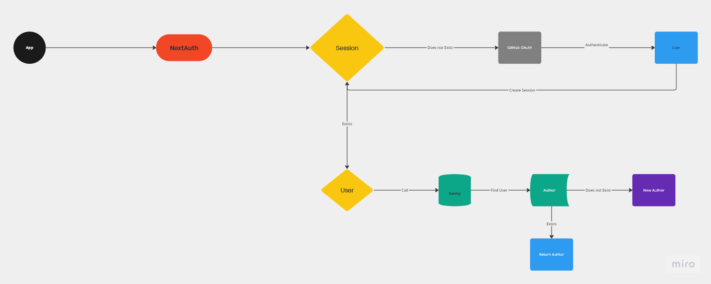
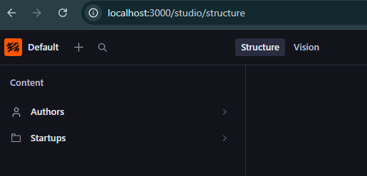
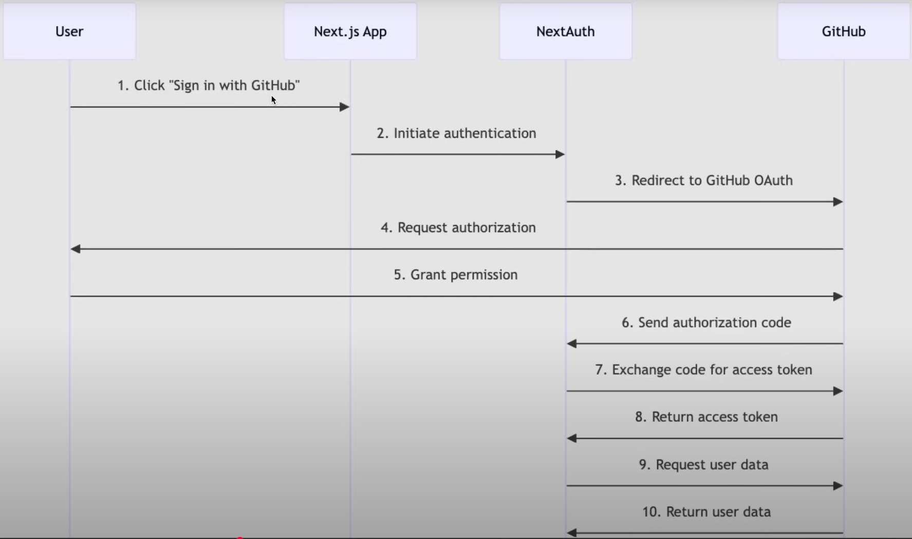
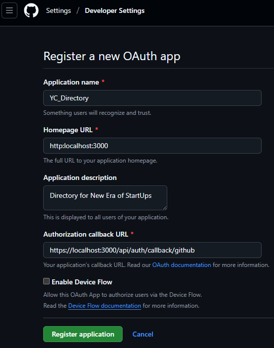

# Notes from start to end

- Setup
- Removed Default `README.md` Content
- Enforcing Dependency Versions
- Starting with Authentication using Auth.js.
- Improve our File and Folder Structure before implementing Authentication.
- Implement Auth in Navbar
- Theming & Fonts
- Hero Section
  - Key Features in Your CSS File Explained
- Search Form
- list of All startUps & Startup card - create one proper re-usable startup card.
- Sanity Setup
- Create Sanity Schemas - so we can structure the types of documents in our database.
- Fetching Data & type Safety - Fetch data from real DB
- Cache and Live API w/Next.js
- Real-Time Search W/URL - Query params
- Understanding Partial Pre-rendering - implement details page.

## Code Startup details Page


## Understanding Partial Pre-rendering - implement startup details page

- so we will create the new folder to implement our details page - under `(root)` -> `startup/[id]/page.tsx`
- Now we need to extract the `id` from url within our code - using `params` - then we take the id and fetch all of the details of that startup.
- let's go to studio & get ourselves the query to fetch the details of startup page.

```query
*[_type=="startup" && _id == $id][0]{
  _id,
    title,
    slug,
    _createdAt,
    author -> {
        _id, name, image , username, bio
      },
      description,
      category,
      image,
      views,
    pitch
}
```

- we will use the query above in `sanity/lib/queries.ts` -> STARTUP_BY_ID_QUERY.
- also here we don't need sanity live fetch - we can implement different rendering strategies on the same page & use one of which is `Partial pre-rendering` - [docs](https://nextjs.org/docs/app/getting-started/partial-prerendering) - Partial Prerendering (PPR) is a rendering strategy that allows you to combine static and dynamic content in the same route. This improves the initial page performance while still supporting personalized, dynamic data.
- You can enable PPR by adding the ppr option to your next.config.ts file
  - The 'incremental' value allows you to adopt PPR for specific routes by adding this line in `.tsx` of that file - `export const experimental_ppr = true`
  - devIndicators are set by defualt
  - Partial Prerendering (ppr) is a new rendering strategy that is still under development. To prevent users from accidentally using an unstable feature in a production app, the Next.js team has restricted its use to the canary channel, which contains the latest, bleeding-edge code.
    - Upgrade to the Canary Version
    - If you intentionally want to experiment with Partial Prerendering, you must upgrade your project to use the canary releases of Next.js and React.
    - Warning: Canary versions are not stable and are not recommended for production use. They may contain bugs or breaking changes.
    - Do `pnpm add next@canary react@canary react-dom@canary`
    - After upgrading, delete the `.next` folder and restart your development server.

## Real-Time Search W/URL - Query params

- Now that we have some posts in the Home page - let's implement the search as well.
- As we know when we search something - it changes/modifies the query in the URL.
  - so first we need to retrieve that query in our application & then further filter the fetch that we're trying to make.
  - we can make that at the Top of page.tsx using the searchParams
  - we add `&& !defined($search) || title match $search || category match $search || author -> name match $search` this in our STARTUPS_QUERY -> which takes care of whether a search exists or if search matches a category or if search matches the author name.
  - Works great

## Cache and Live API w/Next.js

- In sanity/client.ts - `useCdn: true` -> This means that sanity will cache content for 60 seconds & then re-validate the content after every 60 seconds -> This is ISR (Incremental Static Regeneration)
  - To always get new data live and in real-time we'll have to go back to code and set to `useCdn: false` to always get the new data.
  - why is it set to `true` By default? -> when you're fetching from cache and in most cases that is good enough & whenever you don't need real-time data such as for blog posts or even for our existing application we don't need to see newly submitted startups every minute. so it's much faster to get the data from a CDN or from cache.
- for us to explore new features oof nextjs and sanity - we will set it to `false` - so that we get latest data immediately after a refresh & also that is not enough we want to see it immediately without needing to refresh. For that we will use [sanity's Live Content API](https://www.sanity.io/docs/content-lake/live-content-api)
- to implement it within our application - run `pnpm i server-only` - a package that will help us ensure that a specific module can only be used in server components.
  - By importing server-only in a file, you ensure that the code in that file, and any code that depends on it, will only run on the server and not be included in client-side bundles. This helps prevent accidental exposure of server-specific logic or sensitive data to the client.
- next we create a new utility file within `sanity/lib/`live.ts
- Also go to `.env.local` & change SANITY version to use latest one - `NEXT_PUBLIC_SANITY_API_VERSION="vX"`
- Go to `page.tsx` and make one change to our sanity fetch.
  - Whenever you need to query data in your Sanity dataset, import the sanityFetch helper and call it as you would any Sanity client by passing in a GROQ query and any query parameters.
  - The final step to enable the Live Content API is adding the SanityLive React component. It listens for changes in your data and works with your sanityFetch queries to efficiently update content . Include it in application so it renders on any page that needs live content.
  - To test the changes immediately - go to /studio & add new data and see it reflect instantly on the UI. - Worked like a charm.

## Fetching Data

- In order to fetch data from sanity - we'll have to use something known as `GROQ` [Queries](https://www.sanity.io/docs/content-lake/groq-introduction).
- if we can go to vision in studio `http://localhost:3000/studio/vision` - we can write the query and the params and see the results in real time.

```json
*[_type=="startup" && defined(slug.current)]{
  _id,title,slug,author->{_id,name,image}
}
```

- Now let's create a `queries.ts` file in `lib`.
- now to fetch the data let's go to `app/(root)/page.tsx`.
- Now we're able to fetch data directly from sanity studio & that's lovely isn't it.
- Now we don't yet have a `StartupCardType` - which will be necessary for our startup card. We're using typescript, we need to be able to know exactly which properties does each startup have.
- Instead of defining types manually sanity's new tool generates types automatically both for sanity studio schema types and groq querying results.
- To leverage that tool we need to add `sanity-typegen` - [docs reference](https://www.sanity.io/learn/course/content-driven-web-application-foundations/generate-typescript-types)
  - First thing is we have to extract schema we have already created(`startup` & `author` in `/sanity/schemaTypes`)
  - To extract those schemas we need to run an additional command - `npx sanity@latest schema extract --path=./sanity/extract.json` - Re-run this every time you modify your schema types.
    - The --path argument is provided so the schema file is written to the same folder as all our other Sanity utilities.
    - You should see a response like the one below and a newly generated extract.json file in your /sanity directory

```bash
$ npx sanity@latest schema extract --path=./sanity/extract.json
✓ Extracted schema to ./sanity/extract.json
```

- Next we have to create a new file `sanity-typegen.json` and add a configuration object as defined in here from [sanity learn](https://www.sanity.io/learn/course/content-driven-web-application-foundations/generate-typescript-types#s-e4a1f03df160)
  - Without this step, Typegen will look for your schema in the default named schema.json file instead of the extract.json file we have created.
    - The configuration here will:
      - Scan the src directory for GROQ queries to create Types.
      - Additionally, use the extract.json file created during the previous task.
      - Write a new types.ts file with our other Sanity utilities.
  - Then run the command `npx sanity@latest typegen generate` - Re-run this every time you modify your schema types or GROQ queries

```bash
$ npx sanity@latest typegen generate
✓ Generated TypeScript types for 14 schema types and 0 GROQ queries in 0 files into: ./sanity/types.ts
```

- You now have Types for your Sanity Studio schema types and GROQ queries.
- we need to re-run the above commands whenever we change schemas or queries.To automate it , we add them in scripts in package.json. here onwards we can do the following:

```bash
$ pnpm run typegen

> yc_directory_nextjs@0.1.0 typegen C:\Users\abhis\Desktop\NextJs Projects\yc_directory_nextjs
> sanity schema extract --path=./sanity/extract.json && sanity typegen generate

✓ Extracted schema to ./sanity/extract.json
✓ Generated TypeScript types for 14 schema types and 0 GROQ queries in 0 files into: ./sanity/types.ts
```

- Now let's define the type for `StartupCard`-> `StartupTypeCard`.
- Now we know how to fetch new data from database through sanity's GROQ open-source query language -> by first visualizing your queries in `Sanity studio/vision TAB` & then creating them independently in our code calling them in a single line to see those startups & even doing automatic type safety using sanity's typegen.

- Next we will look into now nextjs caches our data & how can we further optimize it depending on the type of our application.
  - we will see what's the best use case for the type of the application where you want to get shown new posts immediately.

## Sanity Schema

- We use this to create our own database structure.
- Whenever you're starting to work on any backend or any kind of database structure specifically - First think about what do you need?
- In our Project:
  - We need to store `Startups` - Submitted by a User
  - which includes the `User` information that submitted those startups.
  - We need to group those Startups into some kind of `Playlist` - so we can show them as editor picks or startup of the month, day, honors and so on.
  - In simple terms this is how the database structure looks like, we will have a ->
    - Startup:
      - Title
      - Slug -> unique name or identifier for that startup
      - Author -> Who created it
      - Views
      - Description
      - Category
      - Image
      - Pitch - In markdown format
    - Author: Will be Authenticated through Github, so we will automatically get it's
      - Id
      - Name
      - Username
      - Email
      - Image
      - Bio
    - playlist: In which we can categorize the startups & then retrieve them
      - Title:
        - Editor Picks
        - Startup of the Day
        - Honors
        - Startup of the Month
        - People's Favorite
      - Slug
      - Select Startups
- [App Workflow](https://miro.com/app/board/uXjVLT_tMdU=/):
  

  - The App hook up to NextAuth to Authenticate our Users & create a session - if a session doesn't exist - We'll head over to GitHub OAuth - Authenticate the user -> Get the user information -> Then Create Session for that user -> if a user exists - then we make a call to sanity to find that user as an Author-> if the user doesn't exist -> we'll create a new Author -> If the Author exists then we'll return that Author & then they'll be able to create different startups.

- let's create a Schema for our Author -> `sanity/schemaTypes/author.ts`

  - `preview`: It will allow us to select those authors by name and preview them.
  - `fields []`: defines the fields that each author will have.
  - we then use the `author` type in `schemaTypes/index.ts`
  - We need to structure this schema in `sanity/structure.ts` - Here we can list different things sanity provides.

- let's create a Startup schema as well -> `sanity/schemaTypes/startup.ts`.

  - we created Rule for certain fields to validate user info.
  - user "markdown" in type which uses the official markdown plugin by sanity. let's install it -> `pnpm i sanity-plugin-markdown`
    - once the plugin is installed let's go to `sanity.config.ts` & add it in Plugins.
    - Then also for this to work - Go to `app/layout.tsx` -> where we have to add all of the general configuration.in this markdown needs additional css -> `import 'easymde/dist/easymde.min.css';` this will make sure that our editor looks great.

- Now if we go to Studio - we would no longer see an empty slate, rather we should be able to create few startups directly from the dashboard.
  
  - let's create a mock author & startup by creating a new author document & publish the author.
  - Now how can we see them within our application, how do we fetch the data from sanity studio.

## Sanity Setup

- until now we have Mock(Fake) Data with us & No way to add new startup info to our app.
- We will use [Sanity](https://www.sanity.io/) - it's not just a CMS, we can leverage their API's to build OS around their content.You'll have studio that will mirror the content workspace of your application which we can hand it over to the client - so they can manage it as well. Which is built on top of their API's that allows you control the way you create and manage the content & they store it as well. many big companies use the SANITY to manage their content.
- They're integrated with Next.js - everything from development to deployment works.
- Create an account and project in it and starting from scratch and Initialize the project with the cli

```bash
pnpm create sanity@latest -- --project ****** --dataset production --template clean --typescript --output-path  studio-jsm-yc-directory
....
...
..
? Please log in or create a new account `GitHub`
✓ Login successful
✓ Fetching existing projects
? Create a new project or select an existing one `JSM YC Directory (******)`
? Select dataset to use `production`
? Would you like to add configuration files for a Sanity project in this Next.js folder? `Yes`
? Do you want to use TypeScript? `Yes`
? Would you like an embedded Sanity Studio? `Yes`
? What route do you want to use for the Studio? `/studio`
? Select project template to use `Clean project with no predefined schema types`
? Would you like to add the project ID and dataset to your .env.local file? `Yes`
.....
....
dependencies:
+ @sanity/image-url 1.2.0
+ @sanity/vision 4.9.0
+ sanity 4.9.0
+ styled-components 6.1.19
....
dependencies:
+ next-sanity 11.1.1

`pnpm install next-sanity@canary`
dependencies:
- next-sanity 11.1.1
+ next-sanity 11.2.0-canary.5
```

- We have got some files created for us during this setup:
  - `sanity.cli.ts` -> Which added env variables for us.
  - `sanity.config.ts` -> pointing to the base path of studio. - which we should be able to explore -> Go to browser and try \_> `http://localhost:3000/studio` -> error showed up -> `pnpm install @sanity/structure` - Had to remove `turbopack` in dev scripts. then we get the login page and sign in with github - we will be in this `http://localhost:3000/studio/structure` and we don't see any document types as we haven't created one yet - as we have chosen clean project during project setup
  - `/sanity/lib/client.ts` -> This is the sanity read client for fetching data through queries, if you set the useCdn part to false - this will make to sure to cache whatever content you request for 60 seconds, After 60 seconds you will get newer version of Data, But in between the content will be delivered from the Sanity CDN (ISR Data fetching strategy).
  - `/sanity/lib/image.ts` -> An Image URL Builder for images uploaded on Sanity Studio, so we can use on front-end side. (not present in current structure may be there could be an alternative or we create it later - [docs reference](https://www.sanity.io/docs/apis-and-sdks/presenting-images)) // TODO: `pnpm add @sanity/image-url` or we will be using a markdown plugin instead - there won't be need of this file.
  - `Sanity/schemaTypes`: currently it's empty and later we'll create our own sanity schemas & export them.so that our entire application knows what kind of fields will each startup or document will have.
  - `sanity/env.ts` -> where we list which kind of envs we need for our application.
  - `Sanity/structure.ts` -> where you decide how do you arrange your schemas.
  - `How does Sanity gets rendered within our app?` -> The sanity team added a `Studio Page` in the `app` directory.simple.

## All startUps & Startup card

- we will create another section in Home page which will wrap all of our startups or startup cards.
- Great Job.

## Search Form

- Create a new component `SearchForm.tsx` in `app/components` folder.
- We are ensuring SearchForm to be rendered on the server side & not on client side.
- [nextjs form component](https://nextjs.org/docs/app/api-reference/components/form).
- we use shadcn [button](https://ui.shadcn.com/docs/components/button)'s instead of default html button.`pnpm dlx shadcn@latest add button` - so we get full code and we can see `components/ui/button.tsx` in the root directory.

## Hero Section(Home Page)

- Also we can create a `utility` class called heading or sub-heading & then we can re-use it across pages.
- Go to `global.css` - add `@layer` - Use the @layer directive to tell Tailwind which "bucket" a set of custom styles belong to. Valid layers are base, components, and utilities - it's better to have utilities rather than having them in className.
- if you guys are getting tailwind css styling errors. try the following. delete the tailwind.config file from the root of your project. replace the code for it to work on tailwind v4.
  - [@theme](https://tailwindcss.com/docs/theme)
- Reason to rename globals.css to global.css - [For Tailwind V4 classes work](https://medium.com/@bloodturtle/the-problem-f71da1eb9faa)
- [Install](https://ui.shadcn.com/docs/cli) `shadcn` CLI - library to help re-use some of the components.The Foundation for your Design System.A set of beautifully designed components that you can customize, extend, and build on.
  - Use the shadcn CLI to add components to your project.
  - Use the `init` command to initialize configuration and dependencies for a new project.
  - The `init` command installs dependencies, adds the `cn` util and configures CSS variables for the project.
  - `pnpm dlx shadcn@latest init`
  - Use the `add` command to add components and dependencies to your project.

```bash
$ pnpm dlx shadcn@latest init
....
...
..
.
added 320, done
✔ Preflight checks.
✔ Verifying framework. Found Next.js.
✔ Validating Tailwind CSS config. Found v4.
✔ Validating import alias.
√ Which color would you like to use as the base color? » Slate
✔ Writing components.json.
✔ Checking registry.
✔ Updating CSS variables in app\global.css
✔ Installing dependencies.
✔ Created 1 file:
  - lib\utils.ts

Success! Project initialization completed.
You may now add components.
```

- Let's build the header of our application in `app/(root)/page.tsx`

### Key Features in Your CSS File Explained

Let's break down the new at-rules from your file:

- @import "tailwindcss";
  This single line replaces the three old directives (@tailwind base;, @tailwind components;, @tailwind utilities;). It's the new, all-in-one entry point for all of Tailwind's styles.

- @theme { ... }
  This is the biggest change. The @theme block is the direct replacement for your tailwind.config.ts file. You define all your design tokens—colors, fonts, breakpoints, etc.—as CSS custom properties.

--color-primary: #ee2b69; in @theme automatically creates utility classes like bg-primary, text-primary, etc.

--breakpoint-xs: 475px; creates the xs: responsive modifier.

- @plugin "..."
  This is the new, simplified way to include official Tailwind CSS plugins like tailwindcss-animate and @tailwindcss/typography.

- @utility ... { ... }
  This is a new, more concise way to create your own custom utility classes. It replaces the old syntax: @layer utilities { .class-name { @apply ... } }. It's essentially a dedicated at-rule for creating reusable styles with @apply.

Old Way (v3):

```CSS
@layer utilities {
.profile_container {
@apply w-full pb-10 pt-20;
}
}
```

New Way (v4):

```CSS

@utility profile_container {
@apply w-full pb-10 pt-20;
}
```

- A word of caution: Because Tailwind v4 is in alpha, its syntax and features are still subject to change before the final release. It's fantastic for learning and personal projects, but be mindful when using it for production applications.

## Theming & Fonts

- Every website also has it's unique themes and font's.
- let's setup tailwind [config](https://github.com/adrianhajdin/yc_directory?tab=readme-ov-file#%EF%B8%8F-snippets).
- `pnpm add tailwindcss-animate` & `pnpm add @tailwindcss/typography`
- we will use `app/layout.tsx` to setup the right font's. currently we're using google fonts now. but it is preferable to have them hosted locally - get them from [in-here](https://drive.google.com/file/d/1OEFHnEq5pQFP86u8FOBLBBNxKPsbjjqU/view).
- `localFont` allowing you to not depend on external services.

## Implement Auth in Navbar

- Style it a bit - refer code & offline notes on what is what.
- Remove the files in public folder.
- Get the logo from Figma
- [Server Action to a form](https://react.dev/reference/rsc/server-functions#server-functions-with-actions) & [from next.js docs](https://nextjs.org/docs/app/guides/forms)
- Our setup looks like this now:
  

## Improve our File and Folder Structure before implementing Authentication

- let's create a new `Route Group` - `(root)` - which will be our `Home Page`. Move our `app/page.tsx` into `(root)/page.tsx` & also create a `layout.tsx` file -> means what we apply to this layout will only be applied to the pages within this route group.
- create `components` folder in `app` directory and create a `Navbar.tsx` component which we will add in `layout.tsx`. if you got to localhost -> you will be able to see `Navbar` at the top and `HOME` below it.
- Right within the Navbar we will implement our NextAuth.

## Starting with Authentication using Auth.js

- [Official Doc](https://authjs.dev/) - which is also known as NextAuth.
- [Installation](https://authjs.dev/getting-started/installation):
  - #1 -> Installing Auth.js
  - #2 -> Setup Environment : The only environment variable that is mandatory is the AUTH_SECRET. This is a random value used by the library to encrypt tokens and email verification hashes. -> Creates a new `.env.local` file with `AUTH_SECRET`.
  - #DOIT -> Implement our configuration: create the Auth.js config file and object. This is where you can control the behavior of the library and specify custom authentication logic, adapters, etc. We recommend all frameworks to create an auth.ts file in the project.
    - create a new `auth.ts` file at the root of your app
    - Add a Route Handler under `/app/api/auth/[...nextauth]/route.ts`.
      - create a the following folders in order under `app` directory/Folder -> `api` FOLDER-> `auth` FOLDER -> `[..nextauth]` FOLDER -> `route.ts` FILE
    - For now `Skipping` : Add optional Middleware to keep the session alive.
    - Setup Authentication Methods: we’ll setup the first authentication methods and fill out that `providers` array - At this point, `you need to decide how you’re gonna authenticate users in your application`. Auth.js supports four main authentication paradigm.
      - We will go with `OAuth`: Recommended because `OAuth services spend significant amounts of money, time, and engineering effort to build abuse detection (bot-protection, rate-limiting), password management (password reset, credential stuffing, rotation), data security (encryption/salting, strength validation), and much more.`
      - We will go with `Github` which one of the popular provider for Authentication.
      - When registering an OAuth application on GitHub, they will all ask you to enter your application’s callback URL.
      - In our case, we need to set it up from scratch - Let's go to `connections` -> `providers` -> [Github](https://authjs.dev/getting-started/providers/github) - here we get all the information on how we can create a new GitHub OAuth App - which we need for the setup. For more instructions head over to this [DOC](https://docs.github.com/en/apps/oauth-apps/building-oauth-apps/creating-an-oauth-app) - steps needed to create a GITHUB OAuth APP.`http://localhost:3000`
        
        - Copy the generated `ClientID` & add it to `.env.local` - add it as `AUTH_GITHUB_ID & AUTH_GITHUB_SECRET`
        - You can also add your app-logo by referring to the complete figma design for this project
        - We will revisit this page again at the end of the course with our new deployed URL.
        - Copy the `configuration` code and add it to our `auth.ts` file - updating our existing file and add a `GITHUB` Provider.
- So How do we make it work? : Go to `app/Page.tsx` & remove all the default code. just add a fragment & HOME text.

```bash
#1
pnpm add next-auth@beta
#2
$ npx auth secret
Need to install the following packages:
auth@1.2.3
Ok to proceed? (y) y

📝 Created C:\Users\abhis\Desktop\NextJs Projects\yc_directory_nextjs\.env.local with `AUTH_SECRET`.
#3

```

## Enforcing Dependency Versions

- If we go to `package.json` - we see we're using latest version of react,react-dom & nextjs & we also need to make sure all the other packages & dependencies we use such as `NextAuth` also use those latest versions & not go back to using react18. So we add Two additional properties in `package.json`.

```json
"packageManager": "pnpm@10.10.0",
  "pnpm": {
    "overrides": {
      "react": "$react",
      "react-dom": "$react-dom"
    }
  },
```

- Then start our server:

```bash
abhis@Tinku MINGW64 ~/Desktop/NextJs Projects/yc_directory_nextjs (main)
$ pnpm run dev

> yc_directory_nextjs@0.1.0 dev C:\Users\abhis\Desktop\NextJs Projects\yc_directory_nextjs
> next dev --turbopack

   ▲ Next.js 15.5.3 (Turbopack)
   - Local:        http://localhost:3000
   - Network:      http://192.168.29.186:3000

 ✓ Starting...
 ✓ Ready in 3.7s
 ○ Compiling / ...
 ✓ Compiled / in 7.5s
 GET / 200 in 8757ms
```

## Removed Default `README.md` Content

````txt
This is a [Next.js](https://nextjs.org) project bootstrapped with [`create-next-app`](https://nextjs.org/docs/app/api-reference/cli/create-next-app).

## Getting Started

First, run the development server:

```bash
npm run dev
# or
yarn dev
# or
pnpm dev
# or
bun dev
```

Open [http://localhost:3000](http://localhost:3000) with your browser to see the result.

You can start editing the page by modifying `app/page.tsx`. The page auto-updates as you edit the file.

This project uses [`next/font`](https://nextjs.org/docs/app/building-your-application/optimizing/fonts) to automatically optimize and load [Geist](https://vercel.com/font), a new font family for Vercel.

## Learn More

To learn more about Next.js, take a look at the following resources:

- [Next.js Documentation](https://nextjs.org/docs) - learn about Next.js features and API.
- [Learn Next.js](https://nextjs.org/learn) - an interactive Next.js tutorial.

You can check out [the Next.js GitHub repository](https://github.com/vercel/next.js) - your feedback and contributions are welcome!

## Deploy on Vercel

The easiest way to deploy your Next.js app is to use the [Vercel Platform](https://vercel.com/new?utm_medium=default-template&filter=next.js&utm_source=create-next-app&utm_campaign=create-next-app-readme) from the creators of Next.js.

Check out our [Next.js deployment documentation](https://nextjs.org/docs/app/building-your-application/deploying) for more details.

````

## Setup

- Installation [instructions](https://nextjs.org/docs/app/getting-started/installation)

```bash
abhis@Tinku MINGW64 ~/Desktop/NextJs Projects/yc_directory_nextjs (main)
$ pnpm create next-app@latest .
.../19952aa74b5-70a4                     |   +1 +
.../19952aa74b5-70a4                     | Progress: resolved 1, reused 0, downloaded 1, added 1, done
√ Would you like to use TypeScript? ... No / Yes
√ Which linter would you like to use? » ESLint
√ Would you like to use Tailwind CSS? ... No / Yes
√ Would you like your code inside a `src/` directory? ... No / Yes
√ Would you like to use App Router? (recommended) ... No / Yes
√ Would you like to use Turbopack? (recommended) ... No / Yes
√ Would you like to customize the import alias (`@/*` by default)? ... No / Yes
Creating a new Next.js app in C:\Users\abhis\Desktop\NextJs Projects\yc_directory_nextjs.

Using pnpm.

Initializing project with template: app-tw


Installing dependencies:
- react
- react-dom
- next

Installing devDependencies:
- typescript
- @types/node
- @types/react
- @types/react-dom
- @tailwindcss/postcss
- tailwindcss
- eslint
- eslint-config-next
- @eslint/eslintrc


   ╭──────────────────────────────────────────╮
   │                                          │
   │   Update available! 10.10.0 → 10.16.1.   │
   │   Changelog: https://pnpm.io/v/10.16.1   │
   │     To update, run: pnpm self-update     │
   │                                          │
   ╰──────────────────────────────────────────╯

Packages: +325
+++++++++++++++++++++++++++++++++++++++++++++++++++++++++++++++++++++++++++++++++++++++++++++++++++++++++++++++++++++++++++++++++++++++++++
Progress: resolved 396, reused 317, downloaded 13, added 325, done

dependencies:
+ next 15.5.3
+ react 19.1.0 (19.1.1 is available)
+ react-dom 19.1.0 (19.1.1 is available)

devDependencies:
+ @eslint/eslintrc 3.3.1
+ @tailwindcss/postcss 4.1.13
+ @types/node 20.19.15 (24.5.0 is available)
+ @types/react 19.1.13
+ @types/react-dom 19.1.9
+ eslint 9.35.0
+ eslint-config-next 15.5.3
+ tailwindcss 4.1.13
+ typescript 5.9.2

╭ Warning ───────────────────────────────────────────────────────────────────────────────────╮
│                                                                                            │
│   Ignored build scripts: @tailwindcss/oxide, sharp, unrs-resolver.                         │
│   Run "pnpm approve-builds" to pick which dependencies should be allowed to run scripts.   │
│                                                                                            │
╰────────────────────────────────────────────────────────────────────────────────────────────╯

Done in 25.5s using pnpm v10.10.0
Success! Created yc_directory_nextjs at C:\Users\abhis\Desktop\NextJs Projects\yc_directory_nextjs


abhis@Tinku MINGW64 ~/Desktop/NextJs Projects/yc_directory_nextjs (main)
$ pnpm approve-builds
√ Choose which packages to build (Press <space> to select, <a> to toggle all, <i> to invert selection) · @tailwindcss/oxide, sharp, unrs-resolver

√ The next packages will now be built: @tailwindcss/oxide, sharp, unrs-resolver.
Do you approve? (y/N) · true
node_modules/.pnpm/@tailwindcss+oxide@4.1.13/node_modules/@tailwindcss/oxide: Running postinstall script, done in 373ms
node_modules/.pnpm/unrs-resolver@1.11.1/node_modules/unrs-resolver: Running postinstall script, done in 247ms
node_modules/.pnpm/sharp@0.34.3/node_modules/sharp: Running install script, done in 266ms
```
